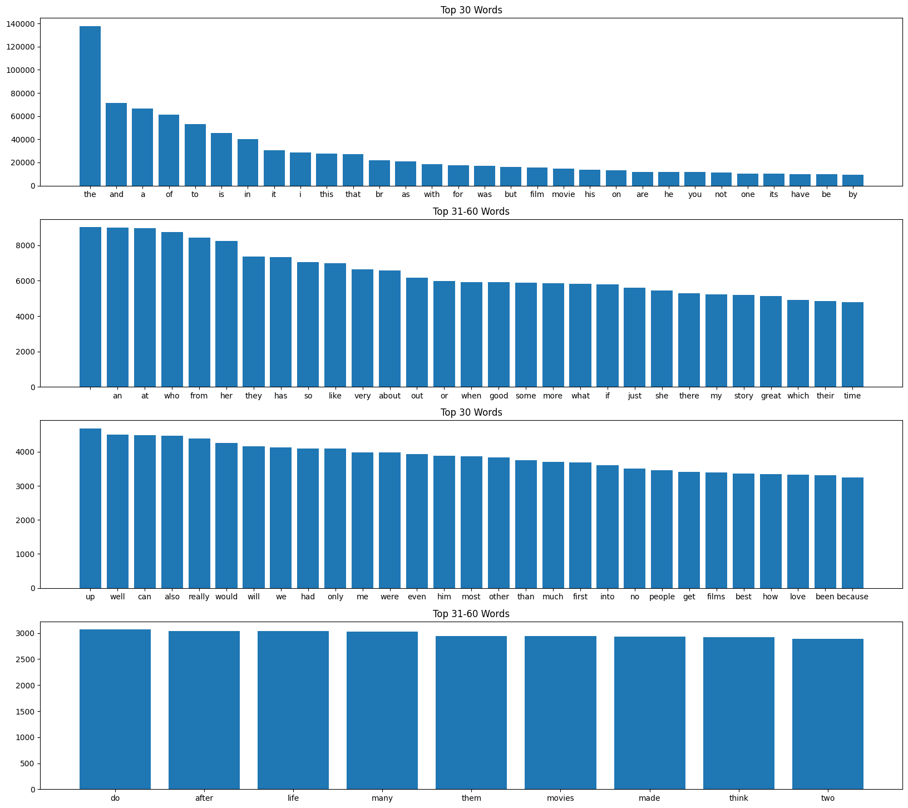

# Sentiment Analysis using Deep Learning and Machine Learning

## Project Overview
This project offers a comprehensive sentiment analysis of the IMDB movie reviews dataset, utilizing a range of deep learning and machine learning techniques. It includes both Bag of Words models and Sequence-to-Sequence models, alongside machine learning approaches like Multinomial Naive Bayes (MultinomialNB) with CountVectorizer and TF-IDF for classifying movie reviews as positive or negative.

The Bag of Words models implemented include:

- A Unigram model, which uses individual words as features.
- A Bigram model, which considers pairs of consecutive words.
- A Trigram model, which considers triplets of consecutive words.
- A Bigram model enhanced with TF-IDF (Term Frequency-Inverse Document Frequency).

The Sequence-to-Sequence models cover several methods:

- One-hot encoded vectors, a simple word representation.
- Word embeddings and pre-trained embeddings using GloVe (Global Vectors for Word Representation).
- Transformers with positional embeddings, representing state-of-the-art techniques in natural language processing.
- MultinomialNB is applied using both CountVectorizer and TF-IDF as feature extraction techniques.

The project also compares the accuracy of these models on test data, providing valuable insights into their performance and effectiveness in sentiment classification. This diverse set of models enables a thorough exploration of sentiment analysis on the IMDB dataset.

## Top 100 words by Frequency

  

## Bag-of-Words Models
Four distinct Bag-of-Words models are implemented, each utilizing different n-gram representations and techniques for text vectorization.

- The UniGram model serves as a baseline, employing individual words for representation and achieving an accuracy of 86.7% on the test data.
- The BiGram model considers pairs of consecutive words, enhancing performance to 89.5%.
- Further improvement is seen with the TriGram model, which captures sequences of three consecutive words, achieving 89.7% accuracy.
- A BiGram model incorporating TF-IDF representation is also introduced. Although it performs slightly worse than the other models, with an accuracy of 88.7%, it showcases the potential of combining n-gram representations with weighted term frequency information.

## Sequence to Sequence Models
Four distinct Sequence-to-Sequence models are implemented, each showcasing different architectures and techniques for text representation and processing:

- The One-Hot Encoded Vectors Model incorporates bidirectional LSTM layers for sequence processing. Despite its computational intensity, it achieves promising results at 85.7% accuracy, demonstrating the effectiveness of bidirectional processing.
- Models with Dense Embeddings utilize dense word embeddings to map integer tokens to dense vector representations. These models exhibit robust performance at 87.1% and lower computational demands compared to one-hot encoding.
- Pretrained GloVe Embeddings Models leverage pretrained embeddings to enhance the representation of input tokens. They showcase improved performance of 87.8% and reduced training time compared to models with randomly initialized embeddings.
- The Transformer Model with Positional Embedding showcases the effectiveness of attention mechanisms in capturing long-range dependencies and contextual information. The performance is 87.1%.

## Multinomial Naive Bayes
MultinomialNB is used in two ways for the analysis:
- First, with CountVectorization, which is simple and effective for obtaining raw word counts but may overemphasize common words.
- Then, with TF-IDF Vectorization, which offers a more refined feature representation by emphasizing rare but important words, making it generally more effective for text classification tasks.

## Model Selection
The Trigram model demonstrated the highest accuracy among the deep learning approaches, emphasizing the importance of capturing word sequences in sentiment analysis. As a result, the Trigram model was selected as the best-performing model and was used to predict sentiment in random movie reviews. In the machine learning approaches, MultinomialNB with TF-IDF outperformed the version using CountVectorizer.

## Predictions on Unseen Reviews
Sentiment prediction is demonstrated on three example sentences using a trained model. The sentences are tokenized into integer sequences using the same tokenizer used during training. The best-trained model, utilizing a 3-gram approach, is loaded for prediction. Predictions are made on the tokenized sequences, resulting in probability scores for positive and negative sentiment classes. A threshold of 0.5 is applied to convert the probability scores into binary classes: values above the threshold are classified as positive sentiment (1), while values below or equal to the threshold are classified as negative sentiment (0).

## Data Source:
https://ai.stanford.edu/~amaas/data/sentiment/aclImdb_v1.tar.gz

## License:
This project is licensed under the Raza Mehar License. See the LICENSE.md file for details.

## Contact:
For any questions or clarifications, please contact Raza Mehar at [raza.mehar@gmail.com].
